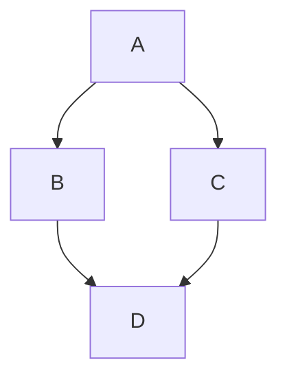
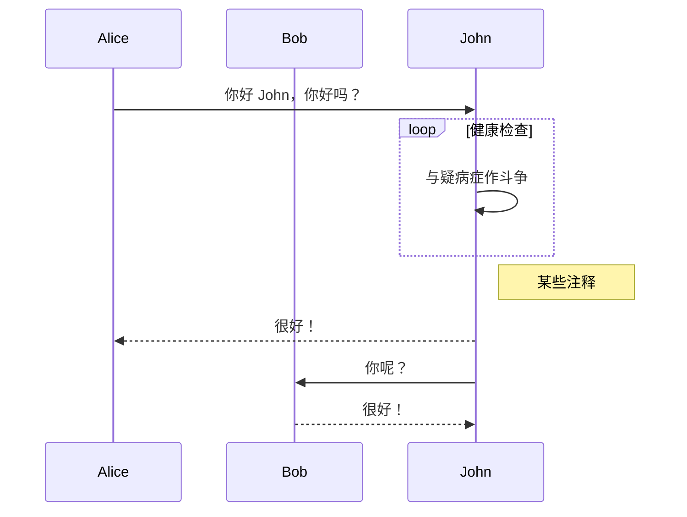
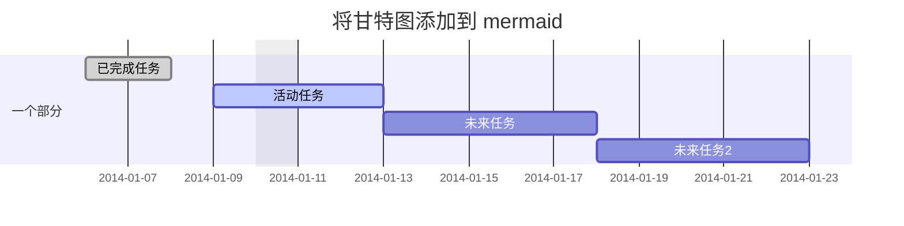
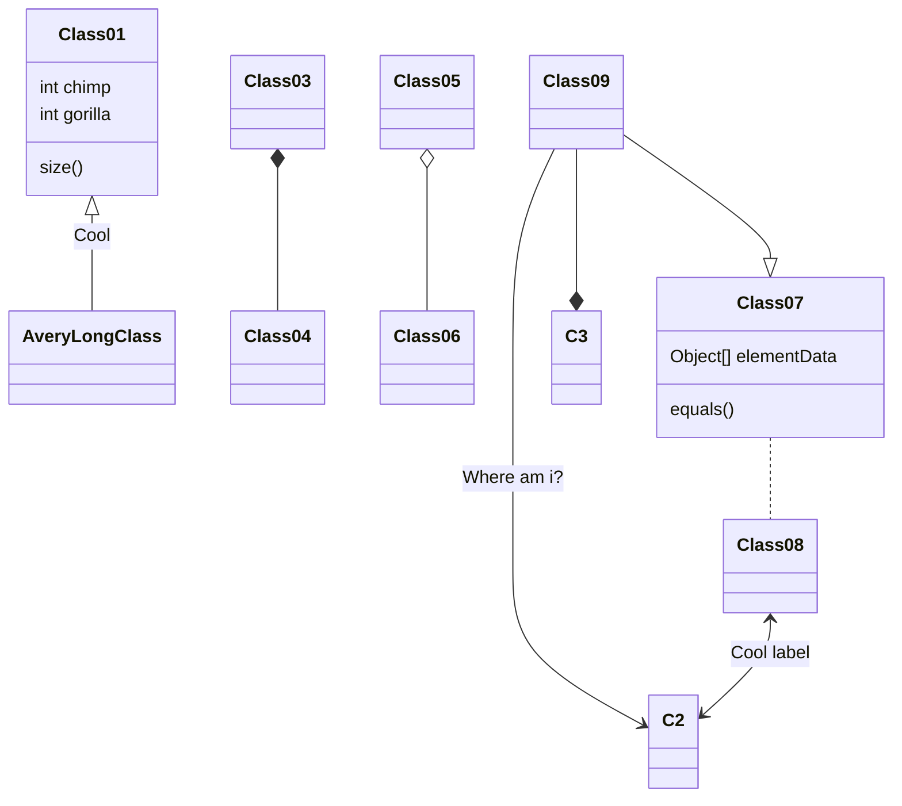
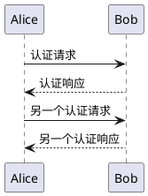

# Markdown 语法

Markdown 是一种易于使用的标记语言，本文档包含所有支持的 Markdown 功能。

## 目录

- [标题](#标题)
- [段落](#段落)
- [换行](#换行)
- [水平线](#水平线)
- [强调](#强调)
  - [粗体](#粗体)
  - [斜体](#斜体)
  - [删除线](#删除线)
- [链接](#链接)
  - [自动链接](#自动链接)
  - [行内链接](#行内链接)
  - [链接标题](#链接标题)
  - [命名锚点](#命名锚点)
- [图片](#图片)
- [引用块](#引用块)
- [列表](#列表)
  - [无序列表](#无序列表)
  - [有序列表](#有序列表)
  - [省时技巧](#省时技巧)
- [待办列表](#待办列表)
- [表格](#表格)
  - [单元格对齐](#单元格对齐)
- [代码](#代码)
  - [行内代码](#行内代码)
  - [围栏代码块](#围栏代码块)
  - [缩进代码](#缩进代码)
  - [语法高亮](#语法高亮)
- [键盘按键](#键盘按键)
- [表情符号](#表情符号)
- [Front Matter](#front-matter)
- [数学公式](#数学公式)
  - [行内数学公式](#行内数学公式)
  - [块级数学公式](#块级数学公式)
- [图表](#图表)
- [原始 HTML](#原始-html)
- [反斜杠转义](#反斜杠转义)
- [致谢](#致谢)

<br/>

## 标题

从 `h1` 到 `h6` 的标题通过每个级别一个 `#` 来构建：

```markdown
# H1
## H2
### H3
#### H4
##### H5
###### H6

或者你可以使用 ATX 标题：

H1
======

H2
------
```

渲染为：

# h1 标题
## h2 标题
### h3 标题
#### h4 标题
##### h5 标题
###### h6 标题

或者你可以使用下划线：

H1
======

H2
------

<br/>

## 段落

直接写普通文本：

```markdown
Lorem ipsum dolor sit amet, graecis denique ei vel, at duo primis mandamus. Et legere ocurreret pri, animal tacimates complectitur ad cum. Cu eum inermis inimicus efficiendi. Labore officiis his ex, soluta officiis concludaturque ei qui, vide sensibus vim ad.
```

<br/>

## 换行

你可以使用多个连续的换行符（`\n`）在 Markdown 文档的各部分之间创建额外的间距。但是，如果你需要确保额外的换行不会被合并，可以使用任意数量的 HTML `<br/>` 元素。

或者，你可以在段落末尾添加**两个空格**来强制软换行。

## 水平线

HTML `<hr>` 元素用于在段落级元素之间创建"主题分隔"。在 Markdown 中，你可以使用以下任意一种：

* `___`：三个连续下划线
* `---`：三个连续破折号
* `***`：三个连续星号

渲染为：

___

---

***

<br/>

## 强调

### 粗体

用于以较粗的字体强调文本片段。

以下文本片段**渲染为粗体文本**。

```markdown
**渲染为粗体文本**
```

渲染为：

**渲染为粗体文本**

### 斜体

用于以斜体强调文本片段。

以下文本片段 _渲染为斜体文本_。

```markdown
_渲染为斜体文本_
```

渲染为：

_渲染为斜体文本_

## 删除线

在 GFM 中，你可以通过用双波浪线包裹文本来实现删除线。

```markdown
~~删除这段文本。~~
```

渲染为：

~~删除这段文本。~~

<br/>

## 链接

### 自动链接

自动链接是 `<` 和 `>` 内的绝对 URI 和电子邮件地址。它们被解析为链接，其中 URI 或电子邮件地址本身用作链接的标签。

```markdown
<http://foo.bar.baz>
```

渲染为：

`http://foo.bar.baz`

未用尖括号包裹的 URI 或电子邮件地址不会被 Markdown 解析器识别为有效的自动链接。

### 行内链接

```markdown
[Assemble](http://assemble.io)
```

渲染为（悬停链接，无工具提示）：

[Assemble](http://assemble.io)

### 链接标题

```markdown
[Upstage](https://github.com/upstage/ "访问 Upstage!")
```

渲染为（悬停链接，应该有工具提示）：

[Upstage](https://github.com/upstage/ "访问 Upstage!")

### 命名锚点

命名锚点使你可以跳转到同一页面上的指定锚点。例如，这些章节：

```markdown
# 目录
  * [章节 1](#chapter-1)
  * [章节 2](#chapter-2)
  * [章节 3](#chapter-3)
```

将跳转到以下部分：

```markdown
## 章节 1
章节一的内容。

## 章节 2
章节二的内容。

## 章节 3 <a name="chapter-3"></a>
章节三的内容。
```

**锚点放置**

请注意，锚点的放置是任意的，你可以将它们放在任何你想要的位置，不仅限于标题中。这使得在编写 Markdown 时添加交叉引用变得容易。

<br/>

## 图片

{/* ⚠️ 本节与英文源文件不一致：上游 GitHub 图片资源已 404，此处改为纯文字说明 */}

图片的语法与链接类似，但前面包含一个感叹号 `!`。有三种写法：

**行内图片（最常用）：**

```markdown


```

- `!` 表示这是一个图片而非链接
- 方括号内是替代文本（图片无法显示时展示，也用于屏幕阅读器）
- 圆括号内是图片 URL
- 引号内是可选的鼠标悬停标题

**脚注风格图片：**

当同一图片在文档中多次引用时，可以分离 URL 定义：

```markdown
![替代文本][id]

<!-- 在文档任意位置定义 -->
[id]: https://example.com/image.png  "可选标题"
```

这种写法的好处是 URL 集中管理，文档正文更干净。

<br/>

## 引用块

用于在文档中定义引用其他来源的文本部分。

要创建引用块，在你想要引用的任何文本前使用 `>`。

```markdown
> Lorem ipsum dolor sit amet, consectetur adipiscing elit. Integer posuere erat a ante
```

渲染为：

> Lorem ipsum dolor sit amet, consectetur adipiscing elit. Integer posuere erat a ante.

引用块也可以嵌套：

```markdown
> Donec massa lacus, ultricies a ullamcorper in, fermentum sed augue.
Nunc augue augue, aliquam non hendrerit ac, commodo vel nisi.
>> Sed adipiscing elit vitae augue consectetur a gravida nunc vehicula. Donec auctor
odio non est accumsan facilisis. Aliquam id turpis in dolor tincidunt mollis ac eu diam.
>>> Donec massa lacus, ultricies a ullamcorper in, fermentum sed augue.
Nunc augue augue, aliquam non hendrerit ac, commodo vel nisi.
```

渲染为：

> Donec massa lacus, ultricies a ullamcorper in, fermentum sed augue.
Nunc augue augue, aliquam non hendrerit ac, commodo vel nisi.
>> Sed adipiscing elit vitae augue consectetur a gravida nunc vehicula. Donec auctor
odio non est accumsan facilisis. Aliquam id turpis in dolor tincidunt mollis ac eu diam.
>>> Donec massa lacus, ultricies a ullamcorper in, fermentum sed augue.
Nunc augue augue, aliquam non hendrerit ac, commodo vel nisi.

<br/>

## 列表

### 无序列表

项目顺序不明确重要的项目列表。

你可以使用以下任意符号来表示每个列表项的项目符号：

```markdown
* 有效项目符号
- 有效项目符号
+ 有效项目符号
```

例如

```markdown
+ Lorem ipsum dolor sit amet
+ Consectetur adipiscing elit
+ Integer molestie lorem at massa
+ Facilisis in pretium nisl aliquet
+ Nulla volutpat aliquam velit
  - Phasellus iaculis neque
  - Purus sodales ultricies
  - Vestibulum laoreet porttitor sem
  - Ac tristique libero volutpat at
+ Faucibus porta lacus fringilla vel
+ Aenean sit amet erat nunc
+ Eget porttitor lorem
```

渲染为：

+ Lorem ipsum dolor sit amet
+ Consectetur adipiscing elit
+ Integer molestie lorem at massa
+ Facilisis in pretium nisl aliquet
+ Nulla volutpat aliquam velit
  - Phasellus iaculis neque
  - Purus sodales ultricies
  - Vestibulum laoreet porttitor sem
  - Ac tristique libero volutpat at
+ Faucibus porta lacus fringilla vel
+ Aenean sit amet erat nunc
+ Eget porttitor lorem

### 有序列表

项目顺序明确重要的项目列表。

```markdown
1. Lorem ipsum dolor sit amet
2. Consectetur adipiscing elit
3. Integer molestie lorem at massa
4. Facilisis in pretium nisl aliquet
5. Nulla volutpat aliquam velit
6. Faucibus porta lacus fringilla vel
7. Aenean sit amet erat nunc
8. Eget porttitor lorem
```

渲染为：

1. Lorem ipsum dolor sit amet
2. Consectetur adipiscing elit
3. Integer molestie lorem at massa
4. Facilisis in pretium nisl aliquet
5. Nulla volutpat aliquam velit
6. Faucibus porta lacus fringilla vel
7. Aenean sit amet erat nunc
8. Eget porttitor lorem

### 省时技巧

有时列表会变化，当它们变化时，重新排序所有数字是很麻烦的。Markdown 通过允许你在列表中的每个项目前简单使用 `1.` 来解决这个问题。

例如：

```markdown
1. Lorem ipsum dolor sit amet
1. Consectetur adipiscing elit
1. Integer molestie lorem at massa
1. Facilisis in pretium nisl aliquet
1. Nulla volutpat aliquam velit
1. Faucibus porta lacus fringilla vel
1. Aenean sit amet erat nunc
1. Eget porttitor lorem
```

自动重新编号并渲染为：

1. Lorem ipsum dolor sit amet
2. Consectetur adipiscing elit
3. Integer molestie lorem at massa
4. Facilisis in pretium nisl aliquet
5. Nulla volutpat aliquam velit
6. Faucibus porta lacus fringilla vel
7. Aenean sit amet erat nunc
8. Eget porttitor lorem

<br/>

## 待办列表

```markdown
- [ ] Lorem ipsum dolor sit amet
- [ ] Consectetur adipiscing elit
- [ ] Integer molestie lorem at massa
```

渲染为：

- [ ] Lorem ipsum dolor sit amet
- [ ] Consectetur adipiscing elit
- [ ] Integer molestie lorem at massa

**待办列表中的链接**

```markdown
- [ ] [foo](#bar)
- [ ] [baz](#qux)
- [ ] [fez](#faz)
```

渲染为：

- [ ] [foo](#bar)
- [ ] [baz](#qux)
- [ ] [fez](#faz)

<br/>

## 表格

通过在每个单元格之间添加管道符作为分隔符，并在标题行下方添加一行破折号（同样用管道符分隔）来创建表格 _（此破折号行是必需的）_。

- 管道符不需要垂直对齐。
- 表格左右两侧的管道符有时是可选的
- 分隔符行中每个单元格必须使用三个或更多破折号

示例：

```markdown
| 选项 | 描述 |
| ------ | ----------- |
| data   | 提供数据文件的路径，用于传递到模板中的数据。 |
| engine | 用于处理模板的引擎。Handlebars 是默认引擎。 |
| ext    | 用于目标文件的扩展名。 |
```

渲染为：

| 选项 | 描述 |
| ------ | ----------- |
| data   | 提供数据文件的路径，用于传递到模板中的数据。 |
| engine | 用于处理模板的引擎。Handlebars 是默认引擎。 |
| ext    | 用于目标文件的扩展名。 |

### 单元格对齐

**居中对齐列中的文本**

要在列中居中对齐文本，请在标题行下方的破折号行左右两侧添加冒号。

```markdown
| 选项 | 描述 |
| :-: | :-: |
| data   | 提供数据文件的路径，用于传递到模板中的数据。 |
| engine | 用于处理模板的引擎。Handlebars 是默认引擎。 |
| ext    | 用于目标文件的扩展名。 |
```

| 选项 | 描述 |
| :-: | :-: |
| data   | 提供数据文件的路径，用于传递到模板中的数据。 |
| engine | 用于处理模板的引擎。Handlebars 是默认引擎。 |
| ext    | 用于目标文件的扩展名。 |

**右对齐列中的文本**

要右对齐列中的文本，请在标题行下方的破折号行右侧添加冒号。

```markdown
| 选项 | 描述 |
| ------:| -----------:|
| data   | 提供数据文件的路径，用于传递到模板中的数据。 |
| engine | 用于处理模板的引擎。Handlebars 是默认引擎。 |
| ext    | 用于目标文件的扩展名。 |
```

渲染为：

| 选项 | 描述 |
| ------:| -----------:|
| data   | 提供数据文件的路径，用于传递到模板中的数据。 |
| engine | 用于处理模板的引擎。Handlebars 是默认引擎。 |
| ext    | 用于目标文件的扩展名。 |

<br/>

## 代码

### 行内代码

用单个反引号包裹行内代码片段：&#96;

例如，要显示 `<div></div>` 与其他文本同行，只需用反引号包裹它。

```markdown
例如，要显示 `<div></div>` 与其他文本同行，只需用反引号包裹它。
```

### 围栏代码块

三个连续的反引号，称为"代码围栏"，用于表示多行代码：&#96;&#96;&#96;

例如：

<pre>
```html
示例文本...
```
</pre>

在浏览器中查看时如下所示：

```markdown
示例文本...
```

### 缩进代码

你也可以通过至少四个空格来缩进多行代码，但不推荐这样做，因为它更难阅读、更难维护，且不支持语法高亮。

示例：

```markdown
    // 一些注释
    代码第 1 行
    代码第 2 行
    代码第 3 行
```

    // 一些注释
    代码第 1 行
    代码第 2 行
    代码第 3 行

### 语法高亮

要激活代码块内语言的正确样式，只需在第一个代码"围栏"后直接添加你要使用的语言的文件扩展名：&#96;&#96;&#96;js，语法高亮将自动应用于渲染的 HTML（如果解析器支持）。例如，要对 JavaScript 代码应用语法高亮：

<pre>
```js
grunt.initConfig({
  assemble: {
    options: {
      assets: 'docs/assets',
      data: 'src/data/*.{json,yml}',
      helpers: 'src/custom-helpers.js',
      partials: ['src/partials/**/*.{hbs,md}']
    },
    pages: {
      options: {
        layout: 'default.hbs'
      },
      files: {
        './': ['src/templates/pages/index.hbs']
      }
    }
  }
});
```
</pre>

渲染为：

```js
grunt.initConfig({
  assemble: {
    options: {
      assets: 'docs/assets',
      data: 'src/data/*.{json,yml}',
      helpers: 'src/custom-helpers.js',
      partials: ['src/partials/**/*.{hbs,md}']
    },
    pages: {
      options: {
        layout: 'default.hbs'
      },
      files: {
        './': ['src/templates/pages/index.hbs']
      }
    }
  }
});
```

<br/>

## 键盘按键

GitHub Flavored Markdown (GFM) 允许你高亮显示键盘按键。

例如：

```markdown
要复制，请按 <kbd>CmdOrCtrl</kbd>+<kbd>C</kbd>

要粘贴，请按 <kbd>CmdOrCtrl</kbd>+<kbd>V</kbd>
```

渲染为：

要复制，请按 <kbd>CmdOrCtrl</kbd>+<kbd>C</kbd>

要粘贴，请按 <kbd>CmdOrCtrl</kbd>+<kbd>V</kbd>

<br/>

## 表情符号

GitHub Flavored Markdown (GFM) 也支持表情符号。:heart_eyes: :smile: :joy:

要添加表情符号，只需用冒号包围表情符号名称，如下所示：

```markdown
:heart: :zap: :cow: :dollar: :star: :tada:
```

渲染为：

:heart: :zap: :cow: :dollar: :star: :tada:

**注意：** MarkText 提供了带有搜索功能的表情符号选择器。

<br/>

## Front Matter

Front Matter 允许你向 Markdown 文档插入元数据。Front Matter 块必须在所有内容之前的第一行编写，如下面的示例所示。

### YAML

YAML front matter 块通过开头和结尾的 `---` 行来标识。

```markdown
---
title: YAML front matter 示例
key: value
---

Lorem ipsum dolor sit amet, graecis denique ei vel, at duo primis mandamus.
```

### TOML

TOML front matter 块通过开头和结尾的 `+++` 行来标识。

```markdown
+++
title = "YAML front matter 示例"
key = "value"
+++

Lorem ipsum dolor sit amet, graecis denique ei vel, at duo primis mandamus.
```

### JSON

JSON front matter 块通过开头和结尾的 `;;;` 行或 `{` 和 `}` 来标识。

```markdown
{
"title": "YAML front matter 示例"
"key": {
  "subkey1": "value 1",
  "subkey2": "value 2"
}
}

Lorem ipsum dolor sit amet, graecis denique ei vel, at duo primis mandamus.
```

<br/>

## 数学公式

### 行内数学公式

用单个美元符号包裹单行 LaTeX：$

```markdown
例如，要显示 $\alpha \beta \gamma$ 与其他文本同行，只需用美元符号包裹它。
```

### 块级数学公式

两个连续的美元符号用于表示多行数学公式：$$

例如：

```markdown
$$
R_x=\begin{pmatrix}
1 & 0 & 0 & 0\\
0 & cos(a) & -sin(a) & 0\\
0 & sin(a) & cos(a) & 0\\
0 & 0 & 0 & 1
\end{pmatrix}
$$

或

$$
m=\frac{b_y-a_y}{b_x-a_x}
$$
```

<br/>

## 图表

MarkText 支持由 flowchart.js、mermaid 和 Vega-Lite 驱动的类图、流程图、甘特图和序列图。使用带有特殊语言标识符的[代码](#代码)块来创建图表。

例如：

<pre>
## Vega-lite 图表

请参阅 [Vega-Lite 入门教程](https://vega.github.io/vega-lite/tutorials/getting_started.html) 了解详情。

```vega-lite
{
  "data": {
    "values": [
      {"a": "C", "b": 2}, {"a": "C", "b": 7}, {"a": "C", "b": 4},
      {"a": "D", "b": 1}, {"a": "D", "b": 2}, {"a": "D", "b": 6},
      {"a": "E", "b": 8}, {"a": "E", "b": 4}, {"a": "E", "b": 7}
    ]
  },
  "mark": "point",
  "encoding": {
    "x": {"field": "a", "type": "nominal"},
    "y": {"field": "b", "type": "quantitative"}
  }
}
```

## 流程图

```flowchart
st=>start: 开始|past
e=>end: 结束|future
op1=>operation: 我的操作|past
op2=>operation: 内容|current
sub1=>subroutine: 我的子程序|invalid
cond=>condition: 是
或 否？|approved:>http://www.google.com
c2=>condition: 好主意|rejected
io=>inputoutput: 捕获内容...|future

st->op1(right)->cond
cond(yes, right)->c2
cond(no)->sub1(left)->op1
c2(yes)->io->e
c2(no)->op2->e
```

## 序列图

```sequence
Title: 这是一个标题
A->B: 普通线
B-->C: 虚线
C->>D: 开放箭头
D-->>A: 虚线开放箭头
```

## 流程图



## 序列图



## 甘特图



## 类图（实验性）


</pre>

## PlantUML

请访问 [PlantUML 网站](https://plantuml.com/) 了解更多详情。



<br/>

## 原始 HTML

`<` 和 `>` 之间的任何看起来像 HTML 标签的文本都将被解析为原始 HTML 标签并渲染为 HTML 而不进行转义。

示例：

```markdown
**访问 <a href="https://github.com">Jon Schlinkert 的 GitHub 个人资料</a>。**
```

渲染为：

**访问 <a href="https://github.com">Jon Schlinkert 的 GitHub 个人资料</a>。**

## 反斜杠转义

任何 ASCII 标点字符都可以使用单个反斜杠进行转义。

示例：

```markdown
\*这不是斜体*
```

渲染为：

\*这不是斜体*

<br/>

## 致谢

此 Markdown 速查表由 [@jonschlinkert](https://twitter.com/jonschlinkert) 创建并修改。源代码可以在[这里](https://gist.github.com/jonschlinkert/5854601)找到。
